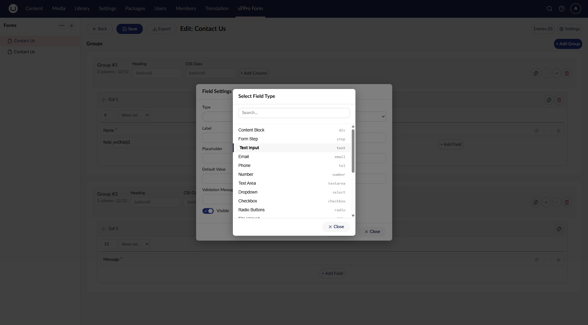

# Field Types

[← Back to README](../README.md)



## Built-in field types

Ships with 19 field types out of the box:

| Type | Description | Dedicated partial? |
|---|---|---|
| `text` | Single-line text input | No (uses `_Default.cshtml`) |
| `email` | Email input | No |
| `tel` | Phone number | No |
| `number` | Numeric input | No |
| `url` | URL input | No |
| `password` | Password input (auto-encrypted at rest) | No |
| `date` | Date picker | No |
| `file` | File upload | No |
| `textarea` | Multi-line text | Yes |
| `select` | Dropdown menu | Yes |
| `checkbox` | Single or multi-checkbox | Yes |
| `radio` | Radio button group | Yes |
| `hidden` | Hidden field | Yes |
| `accept` | Terms & conditions checkbox with link | Yes |
| `range` | Slider with min/max/step | Yes |
| `color` | Color picker | Yes |
| `time` | Time picker with min/max | Yes |
| `div` | HTML content block (not an input) | Yes |
| `step` | Visual step divider | Yes |

Types without a dedicated partial fall back to `_Default.cshtml`, which renders a standard `<input>`.

### File upload field (`v2.1.0+`)

The `file` type renders a file input with two optional settings in the field editor:

| Setting | Attribute | Effect |
|---|---|---|
| **Accept** | `accept` | Comma-separated allowed extensions (e.g. `.pdf,.jpg`). Enforced client-side and server-side. |
| **Max MB** | `maxSize` | Maximum file size in megabytes. Enforced client-side and server-side. |

Uploaded files are sent together with the submission in a single request and are only persisted once the entry validates and is stored — they are saved **outside `wwwroot`** and never served statically. In the backoffice entries list/detail the field shows a download button; the file streams through an authenticated endpoint. If the file field is also marked **Sensitive Data**, it is masked and blocked from download for users without the Sensitive Data permission. See [Public APIs](public-apis.md) and [Security & Permissions](security.md) for details.

## Adding a Custom Field Type

It takes two steps — **no package edits required**.

### Step 1 — Create a Razor partial

Create a `.cshtml` file named after your field type:

```
Views/Partials/uTProSimpleForm/Fields/{yourType}.cshtml
```

Minimal template:

```razor
@using uTPro.Feature.SimpleFormBuilder.Helpers
@model uTPro.Feature.SimpleFormBuilder.Models.FormFieldViewModel
@{ var h = new FieldHelper(Model, ViewData); }

@h.Label()
<input type="text" id="@h.FieldId" name="@h.Name"
       placeholder="@Model.Placeholder"
       value="@Model.DefaultValue"
       @h.RequiredAttr()
       @h.DataMsgAttr() />
@h.Error()
```

uTPro Form auto-detects the new file. No changes to `Default.cshtml` or any config.

### Step 2 — Register it in the backoffice picker

From your own site, register the type in a composer:

```csharp
using Umbraco.Cms.Core.Composing;
using Umbraco.Cms.Core.DependencyInjection;
using uTPro.Feature.SimpleFormBuilder.Services;

public class MyFormFieldsComposer : IComposer
{
    public void Compose(IUmbracoBuilder builder)
        => builder.AdduTProSimpleFormFieldType("yourType", "Your Type Label");
}
```

Register several at once with `builder.AdduTProSimpleFormFieldTypes(...)`. Build and restart. Your new field type now appears in the form builder, merged with the built-in ones.

### Step 3 (optional) — Add custom settings

`v2.2.0+` — A custom type can declare its own settings. The form builder renders a **labelled input for each one** in the field's settings dialog (the same custom area the built-in Time Picker uses for its Min/Max), and saves the entered value into the field's `Attributes` dictionary — no package edits required.

Declare them by passing `SimpleFormFieldAttribute` entries when registering:

```csharp
using uTPro.Feature.SimpleFormBuilder.Models;
using uTPro.Feature.SimpleFormBuilder.Services;

builder.AdduTProSimpleFormFieldType("star-rating", "Star Rating",
    new SimpleFormFieldAttribute("max", "Max Stars", placeholder: "5", inputType: "number"));
```

| `SimpleFormFieldAttribute` argument | Purpose |
|---|---|
| `key` | Key the value is stored under in the field's `Attributes` (read it in the partial with `h.Attr("key")`). |
| `label` | Label shown next to the input in the builder. |
| `placeholder` *(optional)* | Placeholder text for the input. |
| `inputType` *(optional)* | HTML input type — e.g. `text` (default), `number`, `password`. |

Read the value back in your partial via `FieldHelper`:

```razor
@{ var max = h.Attr("max", "5"); }
```

> Values are stored per field, so each form can configure the same custom type differently.
> Leave the standard **Default Value** / **Placeholder** boxes for their usual meaning and keep
> type-specific settings in dedicated attributes.

## FieldHelper — toolkit for field partials

Every field partial can use `FieldHelper` to avoid repetitive HTML:

```razor
@{ var h = new FieldHelper(Model, ViewData); }
```

| Call | Renders |
|---|---|
| `h.FieldId` | Unique HTML id like `uTProForm-contact-us-email` |
| `h.Name` | The field name for form submission |
| `h.Label()` | `<label>` with a red asterisk if required |
| `h.LabelNoFor()` | Label without `for` (for checkbox/radio groups) |
| `h.Error()` | `<span class="uTProForm-error">` for validation messages |
| `h.RequiredAttr()` | Outputs `required` or nothing |
| `h.PatternAttr()` | Outputs `pattern="..."` or nothing |
| `h.DataMsgAttr()` | Outputs `data-msg="..."` with auto-translated dictionary keys |
| `h.Attr("key", "default")` | Reads from `Field.Attributes` with a fallback |
| `h.OptionalAttr("min", val)` | Outputs `min="5"` only if `val` is not empty |

### Multi-language validation messages

Wrap an Umbraco Dictionary key in double curly braces:

```
{{SimpleForm.NameRequired}}
```

`FieldHelper` resolves it to the current culture at render time.

## Full example: Star Rating field

**Step 1** — Create `Views/Partials/uTProSimpleForm/Fields/star-rating.cshtml`:

```razor
@using uTPro.Feature.SimpleFormBuilder.Helpers
@model uTPro.Feature.SimpleFormBuilder.Models.FormFieldViewModel
@{
    var h = new FieldHelper(Model, ViewData);
    var max = h.Attr("max", "5");
}

@h.Label()
<div class="uTProForm-star-rating">
    @for (var i = 1; i <= int.Parse(max); i++)
    {
        <label>
            <input type="radio" name="@h.Name" value="@i"
                   @h.RequiredAttr() @h.DataMsgAttr() />
            ⭐
        </label>
    }
</div>
@h.Error()
```

**Step 2** — Register the type from your site in a composer. Declare a `max` setting so editors can choose how many stars to show (rendered as a labelled input in the builder, `v2.2.0+`):

```csharp
using Umbraco.Cms.Core.Composing;
using Umbraco.Cms.Core.DependencyInjection;
using uTPro.Feature.SimpleFormBuilder.Models;
using uTPro.Feature.SimpleFormBuilder.Services;

public class StarRatingFieldComposer : IComposer
{
    public void Compose(IUmbracoBuilder builder)
        => builder.AdduTProSimpleFormFieldType("star-rating", "Star Rating",
            new SimpleFormFieldAttribute("max", "Max Stars", placeholder: "5", inputType: "number"));
}
```

Done. The field shows up in the builder — with a **Max Stars** input — and renders with stars on the front-end (the partial reads it via `h.Attr("max", "5")`).

> A complete, runnable version of this example ships in the bundled **TestSite**
> (`Examples/StarRatingFieldComposer.cs` + `Views/Partials/uTProSimpleForm/Fields/star-rating.cshtml`),
> demonstrating exactly how a NuGet consumer extends the package from their own project.
