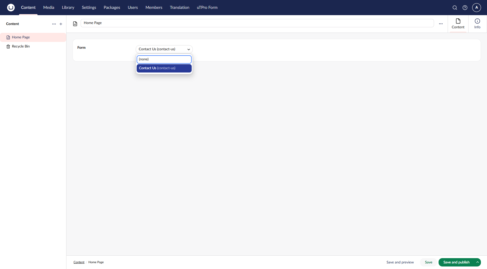
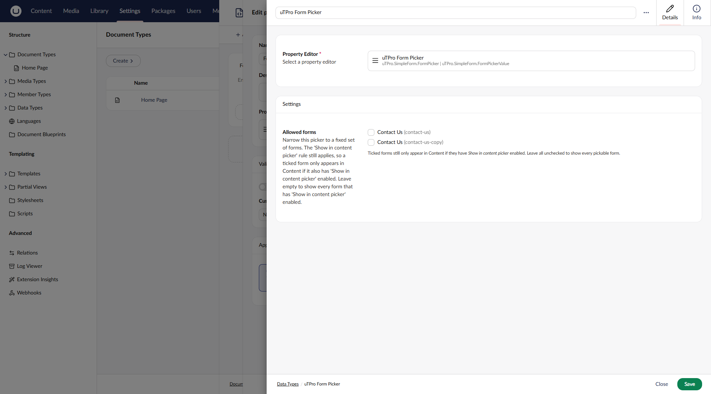

# Picking a Form from Content (Form Picker)

[← Back to README](../README.md)

Instead of hard-coding the alias in a template, editors can choose a form from a Content property.

The package ships a ready-to-use **uTPro Form Picker** data type (created automatically on startup), so you can skip straight to step 2:

1. *(Optional)* Create your own: **Settings → Data Types → Create** → Property Editor **uTPro Form Picker**.
2. Add a property using the **uTPro Form Picker** data type to any Document Type (e.g. a `form` property on *Home*).
3. When editing content, pick a form from the dropdown — it stores the form's **alias**.



4. In the template, read the alias and feed it into the same View Component used for hard-coded rendering:

```razor
@{
    var formAlias = Model.Value<string>("form");
}
@if (!string.IsNullOrWhiteSpace(formAlias))
{
    @await Component.InvokeAsync("uTProSimpleForm", new { alias = formAlias })
}
```

The dropdown only lists forms whose **Show in content picker** toggle (form *Settings*) is on, so you can keep internal/system forms out of the editor's choices while they keep working everywhere else.

## Restricting a picker to specific forms (data type setting)



When you create/edit a **uTPro Form Picker** data type, its **Settings** show an **Allowed forms** list of *every* form (so you can see and tick any of them). Tick the forms this particular picker should offer:

- **Leave it empty** → default behaviour: every form with *Show in content picker* on.
- **Tick one or more forms** → the picker offers only those forms — but the *Show in content picker* rule still applies, so a ticked form appears in Content only if it also has *Show in content picker* enabled.

In other words, the Content list is always **(forms with *Show in content picker* on)**, optionally narrowed to the ticked **Allowed forms**.

## Publish validation

If a content item already stores a form that later becomes unavailable (the form was deleted, had *Show in content picker* turned off, or was removed from the picker's *Allowed forms*), the picker shows it in red as **"— not available"**. **Saving/publishing is then blocked** by a server-side validator with an inline error on the property until the editor chooses another form or clears it (**(none)**). This is enforced by `FormPickerValueValidator` (`PropertyEditors/FormPickerDataEditor.cs`), so it holds even if the value is set through the API.
