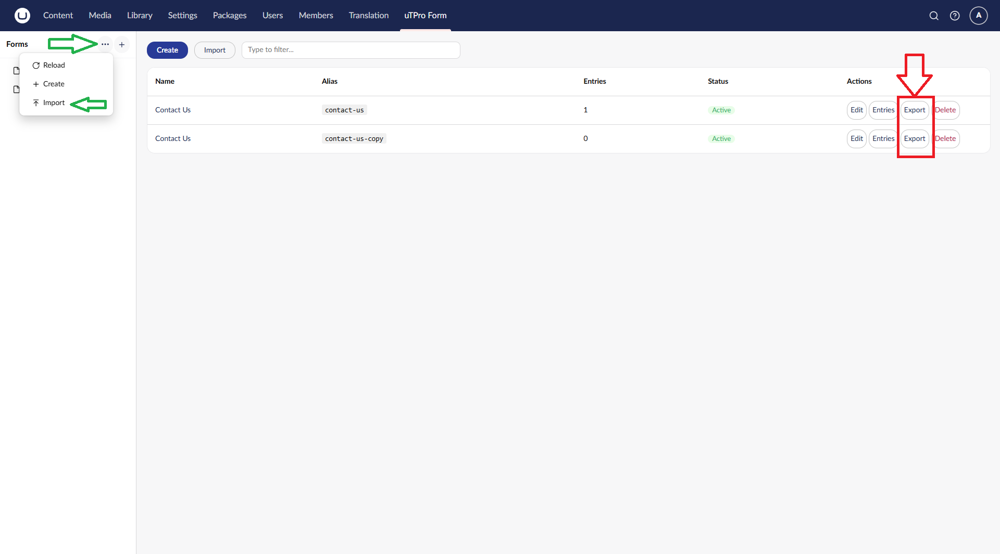

# Public APIs

[← Back to README](../README.md)

REST endpoints for headless or hybrid use cases. These are **anonymous** and bypass backoffice roles — enable them deliberately.

## Submit a form (always available)

```http
POST /api/utpro/simple-form/submit
Content-Type: application/json

{
  "alias": "contact-us",
  "data": { "name": "Jane", "email": "jane@example.com", "message": "Hello!" }
}
```

## Get form definition (opt-in per form: *Enable Render API*)

```http
GET /api/utpro/simple-form/render/{alias}
```

## Get form entries (opt-in per form: *Enable Entries API*, sensitive data always masked)

```http
GET /api/utpro/simple-form/entries/{alias}?skip=0&take=20
```

> ⚠️ Enabling the Entries API exposes that form's submissions (sensitive fields masked) to anyone who knows the alias. Use with care.

## Import / Export



Forms can be moved between environments as JSON (definition only — **no entries, no IDs, no timestamps**).

- **Export** — from the editor toolbar, a form row, or the sidebar **⋯** menu. Downloads `{alias}.form.json`. If the open form has unsaved changes you're asked to save first.
- **Import** — from the list toolbar or sidebar **Options** menu. Always creates a **new** form; if the alias already exists it is auto-suffixed (`-copy`, `-copy-2`, …).

Requires edit permission (`canEdit`).
