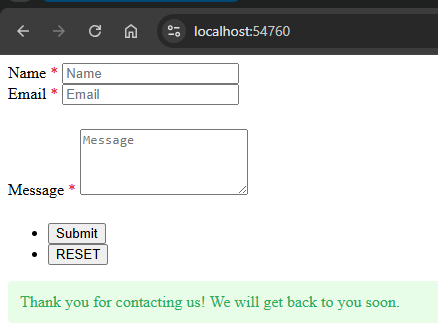

# Rendering a Form

[← Back to README](../README.md)

Drop this into any Razor view or block component:

```razor
@await Component.InvokeAsync("uTProSimpleForm", new { alias = "contact-us" })
```

The `alias` matches the form you created in the **uTPro Form** section.



## Optional parameters

```razor
@await Component.InvokeAsync("uTProSimpleForm", new {
    alias = "contact-us",
    template = "MyLayout",       // use a custom Razor template
    cssClass = "my-form",        // add a CSS class to the <form> tag
    submitBtnText = "Send",      // change the submit button text
    showReset = true,            // show or hide the reset button
    resetBtnText = "Clear"       // change the reset button text
})
```

## Template resolution order

1. `Views/Partials/uTProSimpleForm/{template}.cshtml` — if a `template` parameter was passed
2. `Views/Partials/uTProSimpleForm/{alias}.cshtml` — a view named after the form alias
3. `Views/Partials/uTProSimpleForm/Default.cshtml` — the built-in default

To customize the layout for a specific form, create a file matching its alias. No config changes needed.

## Overriding Views (NuGet users)

When installed via NuGet, all Razor views are compiled into the package DLL. To customize any view, create a file at the **same path** in your web project:

```
YourWebProject/
  Views/Partials/uTProSimpleForm/
    Default.cshtml                  ← overrides the form layout
    Fields/
      textarea.cshtml               ← overrides just the textarea field
      star-rating.cshtml            ← adds a brand new field type
```

ASP.NET Core picks up local files over the ones in the package. No configuration needed.

## Multi-language (dictionary tokens)

Any user-facing text on a form can be translated per culture using the `{{ DictionaryKey }}` token syntax. At render time each token is replaced with the matching **Umbraco Dictionary** value for the current culture. If a key has no translation the original text is kept, so nothing ever disappears.

Supported fields:

| Where | Property |
|---|---|
| Field label | `Label` |
| Field placeholder | `Placeholder` (incl. the `select` empty option) |
| Option text | `Options[].Text` for `select`, `radio`, `checkbox` (the `Value` is never translated) |
| Validation message | `ValidationMessage` |
| Group title | group `Name` (legend) |
| Submit / Reset button | `submitBtnText` / `resetBtnText` parameters |
| Success message | form `SuccessMessage` |
| Accept field | its `text` and `linkText` attributes |
| Step divider | its `title` |
| Content block (`div`) | any `{{ }}` tokens inside the raw HTML |

Example — enter this as a field label in the form builder:

```
{{ ContactForm.FullName }}
```

Then create a Dictionary item `ContactForm.FullName` in Umbraco (**Settings → Dictionary**) with a value per language (e.g. `Full name` / `Họ và tên`). The label renders in the visitor's culture automatically.

A single string may contain multiple tokens and mix static text:

```
{{ ContactForm.Hello }}, {{ ContactForm.Guest }}!
```

Rendering the button text with a dictionary token:

```razor
@await Component.InvokeAsync("uTProSimpleForm", new {
    alias = "contact-us",
    submitBtnText = "{{ ContactForm.Submit }}"
})
```

> The success message is rendered into `data-success-msg` on the `<form>` (already localized for the page culture) and the front-end script prefers it, so the confirmation shows in the correct language regardless of the submit request's culture.

### Previewing translations in the builder

The form builder has a **language picker** in its toolbar (globe icon). By default it shows the raw `{{ Key }}` syntax so you always see exactly what is stored. Pick a language and the field labels and the Field Settings dialog title switch to that language's dictionary values on the spot. Keys with no translation keep the token, so you can immediately spot what still needs translating. This preview is editor-only and never changes the saved form data.

## JavaScript Hooks

Two front-end hooks for custom client-side logic:

```javascript
// Runs before submission. Return false to cancel, or an object to merge extra data.
window.__uTProFormBeforeSubmit = async function (alias, data, formElement) {
    if (alias === 'contact-us') {
        data.source = 'homepage';
    }
    return data;
};

// Runs after a successful submission.
window.__uTProFormAfterSubmit = function (alias, success, result) {
    console.log('Submitted:', alias, result.message);
};
```

## Styling / CSS classes

The rendered form uses the `uTProForm` class prefix so its styles never collide with the host site. The bundled stylesheet (`~/uTPro/simple-form/css/simple-form.css`) targets these classes — override them in your own CSS to restyle the form:

| Class | Element |
|---|---|
| `.uTProForm` | The `<form>` element |
| `.uTProForm-group` / `.uTProForm-group-title` / `.uTProForm-group-field` | Fieldset group, its legend, and each field wrapper |
| `.uTProForm-options` / `.uTProForm-option` | Checkbox / radio option list and each option |
| `.uTProForm-required` | Required-field asterisk |
| `.uTProForm-error` | Inline validation message |
| `.uTProForm-message` + `.uTProForm-success` / `.uTProForm-fail` | Submit result banner |
| `.uTProForm-content-block` | Raw HTML content block |
| `.uTProForm-step` / `.uTProForm-step-title` / `.uTProForm-step-divider` | Step divider |
| `.uTProForm-range-value` | Range slider value label |

> **Upgrading from 2.0.0 or earlier:** the class prefix was `sf` (e.g. `.sf`, `.sf-error`) and the JS hooks were `window.__sfBeforeSubmit` / `window.__sfAfterSubmit`. Update any custom CSS or hooks to the `uTProForm` names above.
