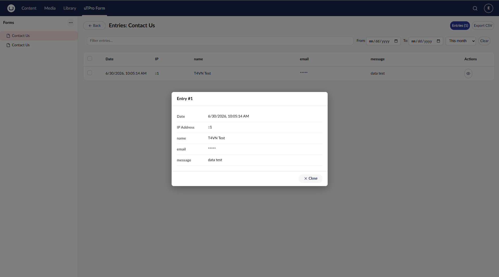

# Security & Permissions

[← Back to README](../README.md)

## Overview

- **Sensitive fields** (password type or fields marked sensitive) are encrypted via ASP.NET Data Protection before storage and masked in the UI by default.
- **Form management** (create/edit/delete, delete entries) requires `canEdit` (admin or Settings access).
- **Sensitive data viewing** requires admin or the `sensitiveData` group.
- **Public APIs** are disabled by default per form and must be explicitly enabled.

## Roles & Permissions

Two things govern access to the backoffice UI:

1. **Section visibility** — a user sees the **uTPro Form** menu only if their user group is granted that section (independent of any other section).
2. **Action permissions** — returned by the API for the current user:
   - `isAdmin` — member of the built-in **Administrators** group.
   - `canEdit` (manage forms) — **admin _or_ the user's group has the _Settings_ section**.
   - `canViewSensitive` — **admin _or_ member of a group whose alias is `sensitiveData`**.

| Capability | Required permission |
|---|---|
| See the **uTPro Form** menu | Group granted the *uTPro Form* section |
| View form list, view entries, export data (CSV / ZIP) | Any backoffice user with the section |
| Download an uploaded file (non-sensitive field) | Any backoffice user with the section |
| Download an uploaded file on a **Sensitive Data** field | Admin or `sensitiveData` group |
| Create / edit / delete forms | `canEdit` (admin or Settings access) |
| Delete entry / bulk delete | `canEdit` |
| See decrypted sensitive/password values (else `*****`) | Admin or `sensitiveData` group |

> The backoffice API requires a valid backoffice login; write actions additionally require `canEdit`. The API is **not** gated by the section — the section grant only controls UI visibility.

## How sensitive-data encryption works (encode / decode)



Encryption uses **ASP.NET Core Data Protection** (`IDataProtector`) — the same primitive Umbraco itself uses. Under the hood it is authenticated symmetric encryption (**AES-256-CBC + HMAC-SHA256**); the protector is created with a fixed *purpose* string (`uTPro.uTProSimpleForm.SensitiveField`).

**Encode (on submit)** — for each field whose **Type is `password`** or that has **Sensitive Data** enabled:

```
storedValue = "uTProEncode:" + Protector.Protect(rawValue)
```

The raw value is encrypted and a marker prefix (`uTProEncode:`) is prepended, then saved into the entry's `DataJson`. Non-sensitive fields are stored as-is.

**Decode (on read)** — when entries are loaded for the backoffice or the entries API, each value is checked for the `uTProEncode:` prefix:

- **Viewer may see sensitive data** (admin or `sensitiveData` group) → `Protector.Unprotect(...)` returns the original value.
- **Otherwise** → the value is replaced with `*****` (never decrypted, never sent to the client).
- If decryption fails (e.g. the key is gone) the value shows as `[decryption error]` rather than leaking ciphertext.

**Important operational notes:**

- **Encryption only applies to NEW submissions** made while the field is sensitive. Turning *Sensitive Data* on later does **not** retro-encrypt or mask values that were already stored as plain text (those have no `uTProEncode:` prefix).
- The encryption **keys are managed by ASP.NET Data Protection**, not by this package. They are persisted by the host (by default under `App_Data`/the configured key ring). **Back them up and keep them stable** — if the key ring is lost or changes, previously encrypted values can no longer be decrypted.
- On a **load-balanced / multi-server** setup, configure a **shared Data Protection key ring** (file share, Azure Blob, Redis, …) so every server can decrypt.
- The marker prefix and *purpose* string are implementation details — changing them in a future version would make existing encrypted values unreadable.

## File uploads (`v2.1.0+`)

Files submitted through a `file` field are stored **outside `wwwroot`**, under
`App_Data/umbraco/Data/uTProSimpleFormUploads/{formAlias}/{yyyyMM}/{guid}{ext}`, so they are
**never served as static content** and cannot be reached by guessing a URL.

- In the entry the value is a `utpro-file:{fileName}|{token}` reference. `{token}` is the
  relative storage path encrypted with `IDataProtector` (purpose `uTPro.uTProSimpleForm.FileToken`),
  so the physical location is never exposed and the reference cannot be tampered with.
- Downloads go through the authenticated backoffice endpoint only. The path is re-confined
  inside the uploads root on every request (defence in depth against path traversal).
- A `file` field marked **Sensitive Data** is encrypted like any other sensitive value; its
  download is denied (and the value masked as `*****`) for users without the *Sensitive Data*
  permission — mirroring the entry-list masking.
- Uploads are written only after the submission validates and is stored. Files are removed
  automatically when the entry or the form is deleted, and rolled back if the submission
  fails or the form does not store entries — so there are no orphaned files.
- The upload endpoint enforces the field's `accept` (extension) and `maxSize` (MB) settings
  on the server, independent of any client-side checks.

## Rate limiting & anti-spam (`v2.3.0+`)

The public submit endpoint is protected by a built-in **per-IP + per-form** fixed-window rate limiter, enabled by default. It runs first in the [submission pipeline](public-apis.md#extending-the-submission-pipeline-iformsubmissionhandler-v230), so throttled requests are rejected before any work is done and nothing is stored.

Partitioning by *IP + form alias* means a flood on one form can't lock visitors out of your other forms. When the limit is exceeded the endpoint returns **HTTP 429** with a "Too many submissions" message.

Configure it under `uTPro:Feature:Form:RateLimit` in `appsettings.json`:

```json
{
  "uTPro": {
    "Feature": {
      "Form": {
        "RateLimit": {
          "Enabled": true,
          "PermitLimit": 5,
          "WindowSeconds": 60
        }
      }
    }
  }
}
```

| Key | Default | Description |
|---|---|---|
| `Enabled` | `true` | Turns per-IP/form throttling on or off. |
| `PermitLimit` | `5` | Maximum submissions allowed per window, per IP + form. |
| `WindowSeconds` | `60` | Length of the fixed window in seconds. |

> **Behind a reverse proxy or load balancer**, the limiter needs the *real* client IP — otherwise every visitor shares the proxy's IP and the limit throttles everyone as one. Make sure the host forwards the client IP. In uTPro, enable the `uTPro:ForwardedHeaders` section (see the uTPro Configurations doc); in a custom host, configure ASP.NET Core forwarded headers yourself.

For custom anti-spam (captcha, honeypot, blocklists) add your own `IFormSubmissionHandler` — see [Extending the submission pipeline](public-apis.md#extending-the-submission-pipeline-iformsubmissionhandler-v230).

## Test Accounts (TestSite)

The bundled `TestSite` auto-seeds the accounts below on startup (see `TestUserSeeder.cs`) so the role/permission matrix can be exercised immediately — even after wiping the database. All share the unattended admin password `Admin1234!`. The seeder also creates the `sensitiveData` and `Admin Custom` user groups and grants them the *uTPro Form* section.

| Email | Group(s) | Behaviour in uTPro Form |
|---|---|---|
| `admin@example.com` | Administrators | Everything: design forms, manage entries, view sensitive data |
| `editor@example.com` | Editor *(+ uTPro Form section)* | View forms & entries, export CSV; **cannot** design/delete; sensitive shown as `*****` |
| `editorSD@example.com` | Editor + `sensitiveData` *(+ uTPro Form section)* | Same as editor, **plus** can view decrypted sensitive values |
| `adminCustom@example.com` | Admin Custom — clone of Administrators (sections incl. **Settings** + uTPro Form) | **Can design/edit/delete forms** (has Settings ⇒ `canEdit`), but sensitive values stay masked (not admin, not `sensitiveData`) |

> **Key rule:** form management (`canEdit`) is granted by the **Settings** section, not by the Administrators group alone. Sensitive-data viewing is a separate lever, granted only by the Administrators group or the `sensitiveData` group.

> The seeder is **TestSite-only** scaffolding — it is not part of the shipped package. In a real site you create users/groups through the backoffice as usual.
